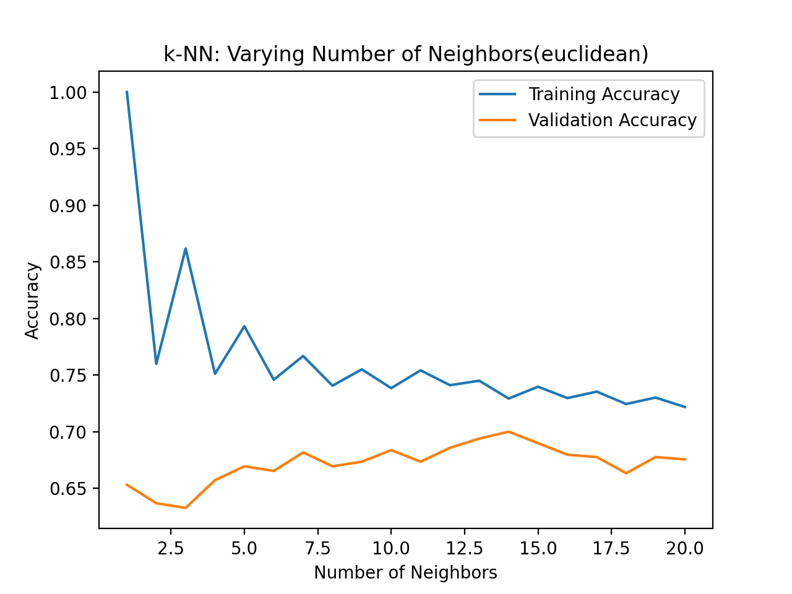
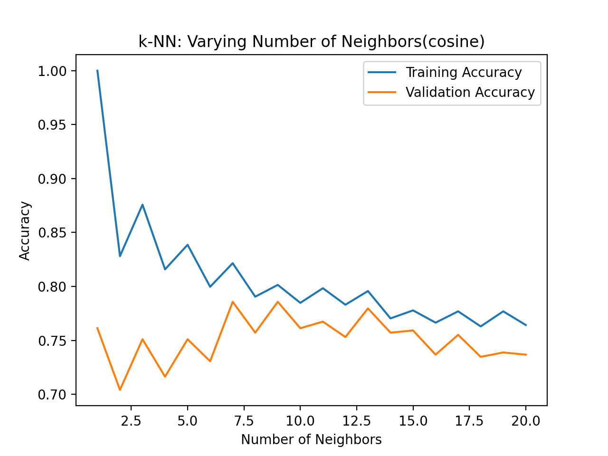
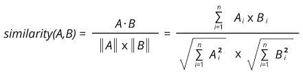

# Question1
Type in ```pytest -s``` in directory ```hw1/question1```, it will print the result as below  

In the test, I check the difference between the value from implemented function and the value from np.linalg.norm(), because there are chances the '==' will return false due to the precision loss of float type.
```
euclidean_for_loop for k=10000 cost: 0.004335165023803711 seconds
euclidean_for_loop for k=100 cost: 3.814697265625e-05 seconds
euclidean_for_vectorized for k=10000 cost: 0.0003001689910888672 seconds
euclidean_for_vectorized for k=100 cost: 1.7881393432617188e-05 seconds
```

# Question2
### The number of samples in each class for training set and validation set:  
- train dataset contains 908 fake data.
- train dataset contains 1378 real data.
- dev dataset contains 195 fake data.
- dev dataset contains 295 real data.

### The Two plots for different k neighbors:  
The accuracy of training data is apparently bigger than the validation data, since we use the training data to train the KNNClassifier.
The accuracy of training data approaches 0.73 as k increases.
- Euclidean Metric  
  For KNNClassifier with Euclidean metric, the accuracy is around mid of 60's, and the trend increase with larger k, but drops later on. 
  
- Cosine Metric
  For KNNClassifier with Cosine metric, the accuracy is around mid of 70's, and the trend increase with larger k, but drops later on.
  
  
### Why Cosine performs better than Euclidean here?
Cosine Distance Definition:  
  
It is used when the magnitude between vectors does not matter but the orientation.

Cosine distance focus on the angle between two vectors,
while euclidean distance focus on the distance between two points.

For dataset like [‘cat’, ‘bulldozer’, ‘cat cat cat’], apparently 'cat' and 'cat cat cat' is similar in cosine
distance comparing with euclidean distance, since the frequency of same word will not affect the angle, but
affect distance between two vectors a lot.

# Question3
Here is the output of naive bayes:
```
Performance on class <REAL>, keeping stopwords
        Precision: 0.9732142857142857    Recall: 0.9492017416545718      F1: 0.9610580455547392

Performance on class <REAL>, removing stopwords
        Precision: 0.815625      Recall: 0.8847457627118644      F1: 0.8487804878048781

Top features for class <REAL>
        ban     52.57589285714284
        korea   48.04348830049259
        travel  38.07219827586206
        turnbull        35.352755541871886
        trumps  33.99303417487686
        australia       25.381465517241363
        climate 21.755541871921174
        north   17.525297619047624
        paris   15.410175492610824
        refugee 14.50369458128078

Top features for class <FAKE>
        breaking        19.857009425150714
        3       17.650675044578406
        soros   15.444340664006104
        black   14.892757068863025
        watch   14.341173473719957
        7       13.238006283433807
        woman   13.238006283433807
        reporter        11.031671902861502
        duke    11.031671902861502
        secret  11.031671902861502
```
- In the train() function, we load the training dataset separated by the classes. For each class, we store the docs and words.
At the same time, we will filter out stop words if required, then calculate the word frequency.  
Then we use 'fake_words_num' and 'real_words_num' to represent the number of appearance of all the words in fake dataset
and real dataset, which are used to avoid duplicated calculation in the training loop.   
- In the score() function, it corresponds to the inner loop of the 'TEST NAIVE BAYES', where the 'sum' is initialized as logprior
of the corresponding class, then for each word in the input doc, sum up all the loglikelihood to the 'sum'. 
- In the predict() function, it keeps calling score() function and return the class that has the maximum score.  
- In the evaluate() function, it uses the learned logprior and loglikelihood to test the validation data, then calculate
the number of TP, FP, TN, FN to get precision, recall and f1_score.